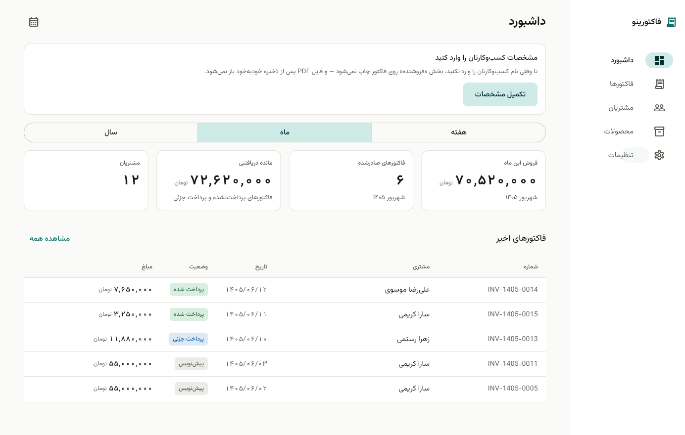
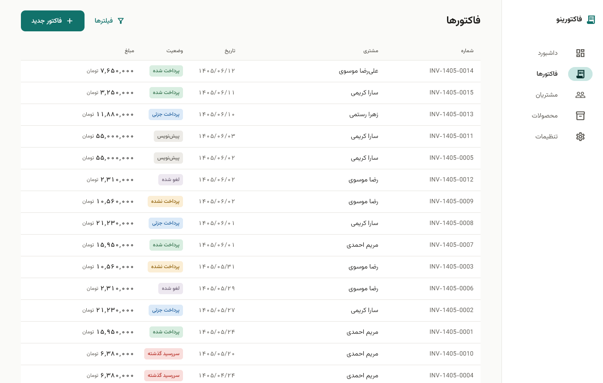
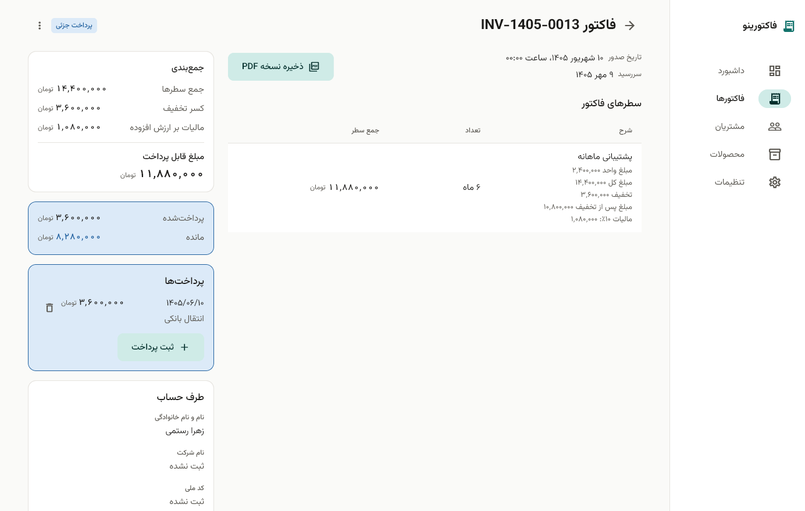
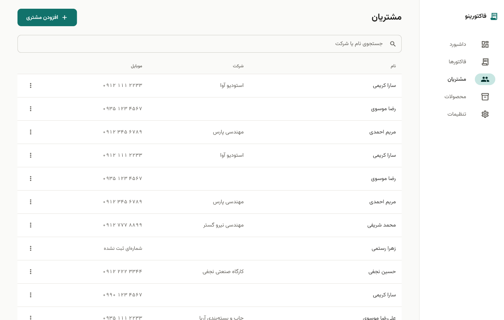
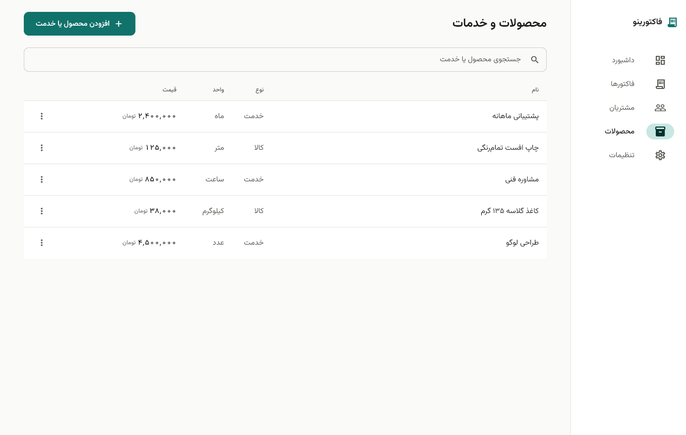
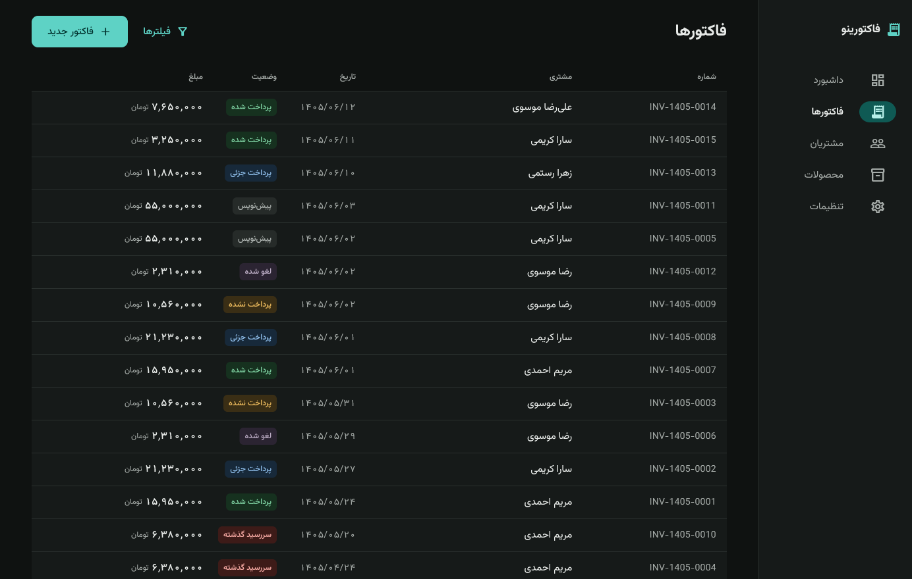
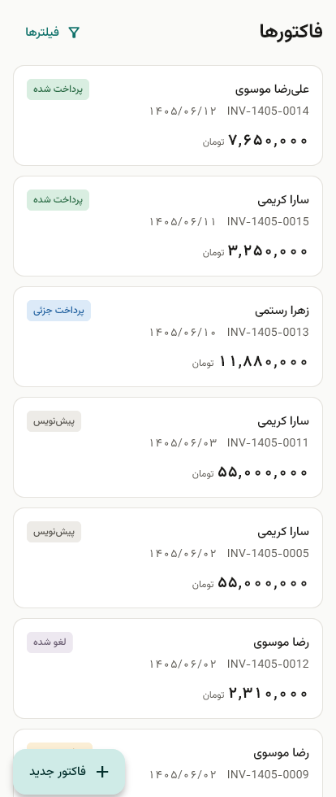
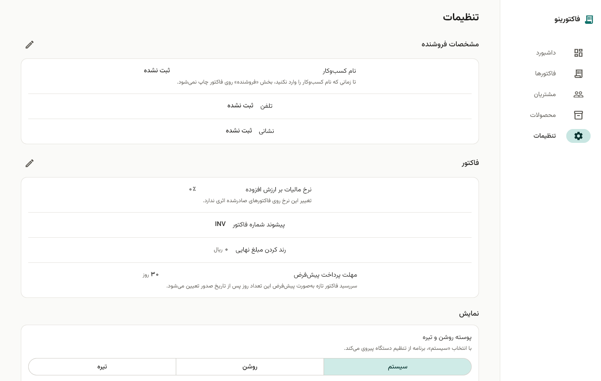

<div align="center">


# فاکتورینو

**نرم‌افزار صدور فاکتور و صورت‌حساب برای فریلنسرها و کسب‌وکارهای کوچک ایرانی**

کاملاً آفلاین · فارسی و راست‌به‌چپ · تاریخ شمسی · مبلغ به تومان

[](https://github.com/DadeEdran/Factorino/releases/latest/download/factorino-arm64.apk)
[](https://github.com/DadeEdran/Factorino/releases/latest/download/factorino-windows-x64.zip)



</div>

---

<div dir="rtl">

## این برنامه چیست؟

فاکتورینو یک برنامه صدور فاکتور و صورت‌حساب برای فریلنسرها، کسب‌وکارهای کوچک، کارگاه‌ها و
ارائه‌دهندگان خدمات است. مشتری و محصول ثبت می‌کنید، فاکتور صادر می‌کنید، پرداخت‌ها را پیگیری
می‌کنید، و خروجی PDF می‌گیرید.

سه نکته که باید از اول بدانید:

- **کاملاً آفلاین است.** هیچ حساب کاربری ندارد، به اینترنت وصل نمی‌شود، و هیچ اطلاعاتی از گوشی یا
  کامپیوتر شما بیرون نمی‌رود. همه‌چیز فقط روی همان دستگاه ذخیره می‌شود.
- **پشتیبان‌گیری را جدی بگیرید.** چون اطلاعات فقط روی دستگاه شماست، اگر دستگاه را از دست بدهید
  اطلاعات هم از بین می‌رود. از بخش تنظیمات فایل پشتیبان بگیرید و جای امنی نگه دارید.
- **این نسخه آزمایشی است.** اگر ایرادی دیدید — به‌ویژه هر متن انگلیسی داخل برنامه — لطفاً در بخش
  [Issues](https://github.com/DadeEdran/Factorino/issues) گزارش کنید.

## دانلود و نصب

آخرین نسخه را از صفحه [Releases](https://github.com/DadeEdran/Factorino/releases/latest) بگیرید.

| فایل | پلتفرم | توضیح |
|---|---|---|
| [`factorino-arm64.apk`](https://github.com/DadeEdran/Factorino/releases/latest/download/factorino-arm64.apk) | اندروید | گوشی‌های ۶۴ بیتی (تقریباً همه گوشی‌های امروزی) |
| [`factorino-windows-x64.zip`](https://github.com/DadeEdran/Factorino/releases/latest/download/factorino-windows-x64.zip) | ویندوز | ویندوز ۱۰ و ۱۱، ۶۴ بیتی |
| [`README-fa.txt`](https://github.com/DadeEdran/Factorino/releases/latest) | — | راهنمای کامل فارسی برای آزمایش‌کننده‌ها |

### نصب روی اندروید

۱. فایل `factorino-arm64.apk` را دانلود کنید.
۲. فایل را باز کنید. اندروید می‌پرسد که آیا اجازه نصب از این منبع را می‌دهید — چون برنامه از
   گوگل‌پلی نمی‌آید، باید یک‌بار اجازه بدهید.
۳. اگر پیام «برنامه ناشناس» دیدید، گزینه «نصب کن» یا Install anyway را بزنید.

> برنامه هیچ دسترسی‌ای به مخاطبین، پیامک یا موقعیت مکانی نمی‌خواهد و به اینترنت وصل نمی‌شود.

### نصب روی ویندوز

۱. فایل `factorino-windows-x64.zip` را دانلود کنید.
۲. آن را در یک پوشه دلخواه از حالت فشرده خارج کنید (Extract All).
۳. `factorino.exe` را اجرا کنید.

> ویندوز ممکن است پیام SmartScreen نشان بدهد چون فایل امضای دیجیتال تجاری ندارد.
> روی **More info** و بعد **Run anyway** بزنید. برنامه نیازی به دسترسی Administrator ندارد و
> اطلاعات را در پوشه کاربری خودتان (`%APPDATA%`) ذخیره می‌کند، نه کنار فایل اجرایی.

## امکانات

- **مشتریان** — نام، موبایل، نام شرکت، نشانی، کد ملی و کد اقتصادی، با جست‌وجوی هوشمند فارسی
  (اگر مشتری را «علي» ذخیره کرده باشید، با نوشتن «علی» هم پیدا می‌شود).
- **محصولات و خدمات** — قیمت، واحد (عدد، ساعت، متر، کیلوگرم، ماه و…)، و تفکیک کالا از خدمت.
- **فاکتورها** — شماره‌گذاری خودکار شمسی (مثل `INV-1405-0014`)، تخفیف سطری و کلی، مالیات بر ارزش
  افزوده قابل تنظیم، و تاریخ سررسید.
- **پرداخت‌ها** — ثبت پرداخت جزئی یا کامل؛ وضعیت فاکتور خودش به‌روز می‌شود.
- **وضعیت‌ها** — پیش‌نویس، پرداخت‌نشده، پرداخت جزئی، پرداخت شده، سررسید گذشته، لغو شده.
- **خروجی PDF** — فاکتور رسمی فارسی و راست‌به‌چپ.
- **پشتیبان‌گیری و بازیابی** — فایل پشتیبان رمزگذاری‌شده با رمز عبور خودتان.
- **پوسته روشن و تیره** — یا پیروی از تنظیم دستگاه.
- **چیدمان واکنش‌گرا** — روی گوشی کارت، روی ویندوز جدول و چیدمان چندستونی.

## تصویرها

<div align="center">

**فهرست فاکتورها** — وضعیت هر فاکتور با رنگ مشخص است



**جزئیات فاکتور** — جمع‌بندی، تخفیف، مالیات و پرداخت‌ها



**مشتریان و محصولات**




**پوسته تیره و نمای موبایل**




**تنظیمات**



</div>

## حریم خصوصی و امنیت

- برنامه به اینترنت وصل نمی‌شود و هیچ اطلاعاتی ارسال نمی‌کند.
- روی اندروید و ویندوز، پایگاه‌داده روی دیسک **رمزگذاری‌شده** است و کلید آن در حافظه امن سیستم
  (Android Keystore / Windows DPAPI) نگهداری می‌شود.
- فایل‌های پشتیبان با رمز عبوری که خودتان انتخاب می‌کنید رمزگذاری می‌شوند. **اگر این رمز را فراموش
  کنید، فایل پشتیبان قابل بازیابی نیست.**

</div>

---

## For developers

Factorino is a Flutter application shipping on **Android and Windows**, built offline-first around
an encrypted local SQLite database. The entire user interface is Persian and RTL; all code, comments
and documentation are English.

A Web target is scaffolded but not shipped — Drift on the web needs `sqlite3.wasm` and
`drift_worker.js`, and browser storage cannot be meaningfully encrypted at rest, so Web is treated
as the least-trusted target and left for a later phase.

### Stack

| Concern | Choice |
|---|---|
| Framework | Flutter 3.47 (stable), Material 3 |
| State | Riverpod (code-generation flavor) |
| Persistence | Drift + SQLite, encrypted via SQLite3 Multiple Ciphers (`sqlite3mc`) |
| Routing | `go_router` |
| Calendar | `shamsi_date` (Jalali) |
| Key storage | `flutter_secure_storage` |

### Design constraints worth knowing

- **Money is never a `double`.** All amounts are integer Rial in a 64-bit `int`; percentages are
  basis points; quantities are integers scaled by 1000. The calculation engine in `lib/core/money/`
  is pure Dart with zero Flutter imports, and the invariant
  `grandTotal == subtotal - invoiceDiscount + totalTax` is unit-tested.
- **Timestamps are stored as UTC epoch milliseconds and displayed as Jalali.** Reporting periods are
  Jalali months, not Gregorian ones.
- **Every user-data table is sync-ready**: UUID primary keys, `created_at` / `updated_at` /
  `deleted_at` soft deletes, and `sync_status`. Nothing is hard-deleted.
- **Invoice items snapshot** the product title, unit and unit price, so changing a product's price
  never rewrites an already-issued invoice.

### Build

```bash
flutter pub get
dart run build_runner build --delete-conflicting-outputs

flutter run -d windows        # or: -d android
flutter build apk --release --target-platform android-arm64
flutter build windows --release
```

Release signing reads `android/key.properties`, which is gitignored — copy
`android/key.properties.example` and fill it in. The keystore itself is never committed.

### Tests

```bash
flutter analyze
flutter test
```

**1,382 tests across 97 files** cover the money engine, Jalali boundary conversion, Persian digit
normalization, national-ID validation, invoice number allocation, Drift schema migrations, and
layout checks at all three responsive tiers.

### Documentation

The `docs/` directory is the project's working memory and is kept current:

| File | Contents |
|---|---|
| [`docs/CURRENT_STATE.md`](docs/CURRENT_STATE.md) | Current phase, next action, verification status |
| [`docs/ARCHITECTURE.md`](docs/ARCHITECTURE.md) | The architecture as actually implemented |
| [`docs/DECISIONS.md`](docs/DECISIONS.md) | Every significant decision, with reasons and alternatives |
| [`docs/ROADMAP.md`](docs/ROADMAP.md) | Phases, status and per-phase security notes |
| [`docs/PROJECT.md`](docs/PROJECT.md) | Stable high-level description |

### Status

Working: customers, products, invoicing with payments, PDF export, encrypted backup and restore,
dashboard, light/dark theming, and the responsive shell across mobile, tablet and desktop.

Not built yet: cloud sync (Supabase), authentication, and advanced reporting. The schema is already
sync-ready so that adding sync will not require migrating live user data.
